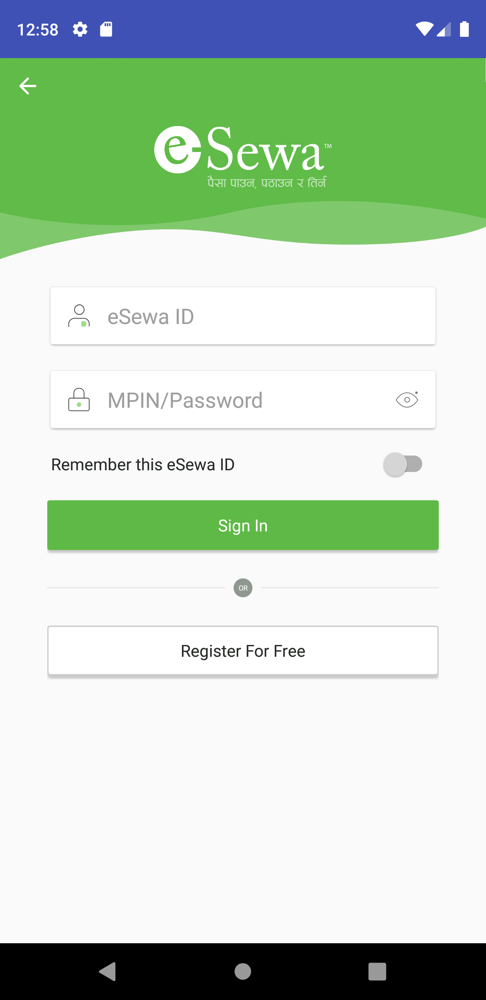

# esewaSDK
esewa aar binding for Xamarin Forms 
Currently available binding dll for Xamarin Android. 
This project includes the esewa AAR binding. 
AAR Binding project is availble under aar binding folder.

## Available Bindings
1) esewaSDK.aar (May 15, 2020)

Note: Use android:theme="@style/MainTheme" inside application tag of Android Menifist file.

## Preview

## Xamarin Implementation for esewa, Khalti and Esewa (Native Library Bindings)
Link: https://github.com/exendahal/epayNepal
